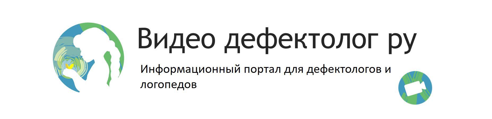


[](https://github.com/timoncraus/videodef/actions/workflows/tests.yml)
[](https://codecov.io/gh/timoncraus/VideoDef)

[](https://github.com/timoncraus/videodef/pulls?q=is%3Apr+author%3Aapp%2Fdependabot)


# 🌟 Обзор

Информационный портал для дефектологов и логопедов, предоставляющий инструменты для дистанционного обучения детей с ОВЗ. \
Имеются чаты, видеозвонки, личный кабинет, игры, система резюме и документов, поиск преподавателей.

Функционал родителя и преподавателя различается - преподаватели могут создавать документы и ссылающиеся на них документы; родители могут создавать и удалять информацию о своих детях, искать преподавателей по их резюме и писать им, когда им кто-то понравился \
(разное отображение вкладок у преподавателей и родителей).

Оба типа пользователя могут создавать и редактировать игры, участвовать в переписке (создавая сообщения), редактировать информацию в своем профиле и аватарку, начинать видеозвонок и т.д. - см. [Возможности](#-возможности) ниже.

Проект принимал участие в грантовом конкурсе "Росмолодёжи" и успешно защищался во время мероприятия университетского пространства "Точка кипения".

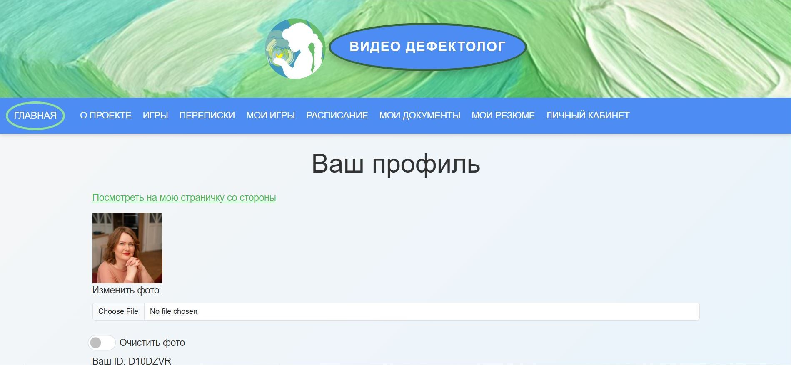

| 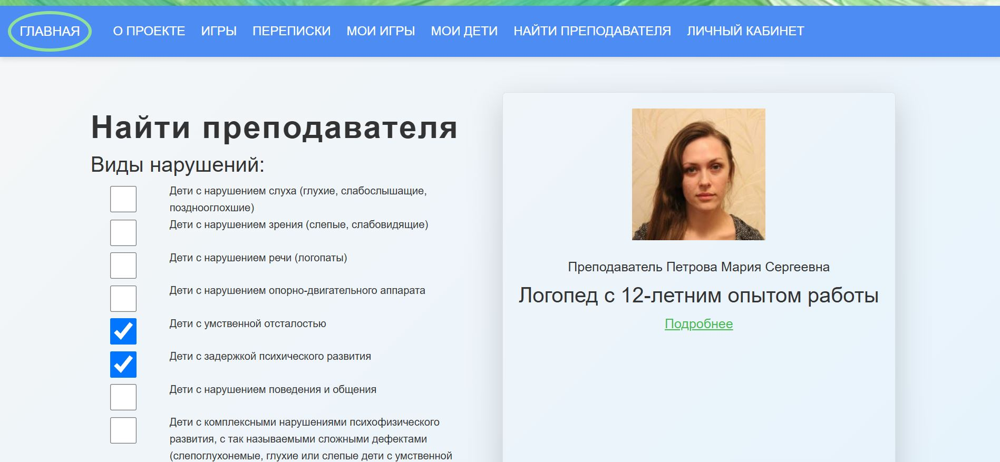 | 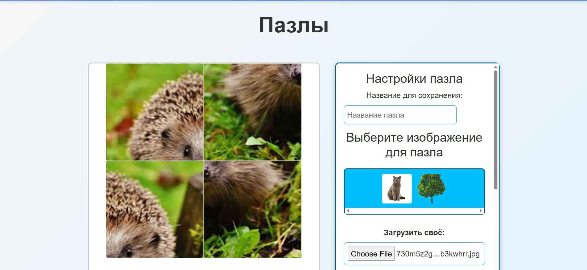 |
|--------------------------------------------------------|----------------------------------------------------|
| 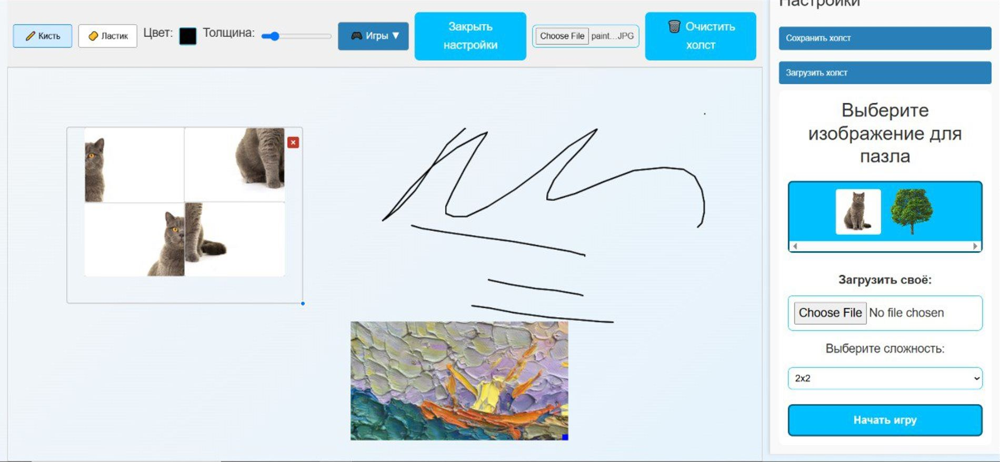 | 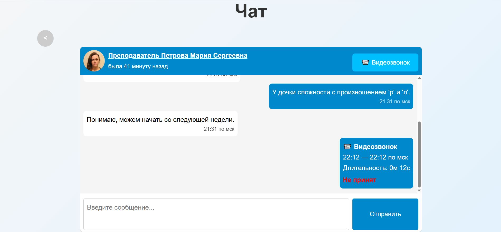 |


# 🔍 Навигация

[1. Обзор](#-обзор) \
[2. Возможности](#-возможности) \
[3. Стек технологий](#-стек-технологий) \
[4. Галерея](#-галерея) \
[5. Установка](#%EF%B8%8F-установка) \
[6. Переменные окружения .env](#-переменные-окружения-env) \
[7. Заполнение тестовыми данными](#-заполнение-тестовыми-данными) \
[8. Заполнение минимальными данными](#-заполнение-минимальными-данными) \
[9. Использование](#-использование) \
[10. Архитектура и документация](#-архитектура-и-документация) \
[11. Диаграммы](#-диаграммы) \
[12. Примеры SQL скриптов](#-примеры-sql-скриптов) \
[13. Авторы](#-авторы) \
[14. Перспективы развития](#-перспективы-развития)

# 🔥 Возможности

Личный кабинет и добавление информации о детях:
---
- Регистрация и вход в систему.
- Удобные поля для ввода данных, а также календарь для ввода даты.
- Возможность войти разными способами - по логину, Email, номеру телефона или ID.
- Генерация ID нового пользователя вручную - 7 символов из цифр или заглавных латинских букв (например, "AN7SPI2") для более быстрого и удобного поиска среди пользователей.
- Редактирование профиля и возможность загрузить свою аватарку.
- Красивое и удобное отображение страницы профиля для сторонних пользователей.
- Ссылка, чтобы посмотреть на свой профиль со стороны.
- Создание, редактирование и удаление информации о детях.
- Возможность загрузить фотографию ребенка.
- Отображение информации о детях в профиле для сторонних пользователей.

Видеозвонки:
---
- Видеозвонки с возможностью запуска игр и демонстрации материалов.
- Уведомление "Вам звонят" с указанием информации в реальном времени.
- Возможность принять или отклонить входящий звонок.
- Возможность завершить звонок и отключить камеру или микрофон во время звонка.
- Синхронизация действий интерактивных игр и белой доски во время видеозвонка.

Чат:
---
- Чат для общения преподавателей и родителей с ссылкой на профиль аккаунта и кнопкой начать видеозвонок.
- Отображение нового сообщения в реальном времени.
- Разделение на правые и левые сообщения в зависимости от сохраненного отправителя сообщения.
- Отображение времени отправления сообщения по мск.
- Разделительная черта с указанием даты между сообщением разных дней.
- Отображение последнего онлайна.
- Отображение информации о видеозвонках (начало, конец, длительность, принят/не принят) вместе с сообщениями, отсортированными по дате-времени.
- Список чатов с другими пользователями.

Резюме и документы:
---
- Создание, редактирование и удаление резюме и документов.
- "Найти преподавателя" - возможность выбрать определенные виды нарушений и отобразить все подходящие резюме с данными видами нарушений.
- Возможность написать в чат преподавателю в "Найти преподавателя".
- Красивое и удобное отображение резюме для сторонних пользователей.
- Возможность выбрать несколько типов нарушений (связь многие ко многим).
- Возможность прикрепить несколько документов к резюме (связь многие ко многим).
- Возможность загрузить до 5 картинок для резюме и для документов.
- Система со статусом проверки документов преподавателей администраторами.

Игры:
---
- Создание и редактирование обучающих игр с панелью настроек.
- Игра "Белая доска" с карандашом, ластиком и возможностью загрузить свою картинку.
- Игра "Пазл" (2x2 или 4x4) с возможностью загрузить свою картинку или выбрать из имеющихся шаблонов.

# 💻 Стек технологий

В проекте используются Python, Django, Django Channels, Websocket, PostgreSQL, JavaScript, Webpack, WebRTC, Bootstrap. \
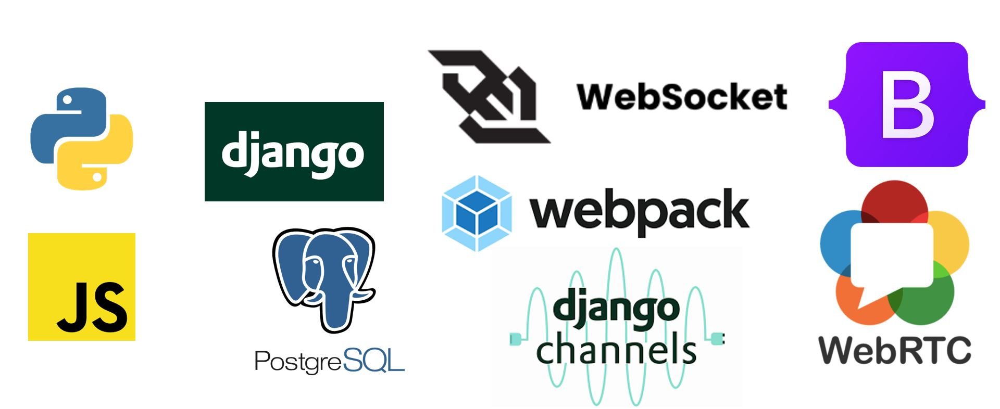

# 🖼 Галерея

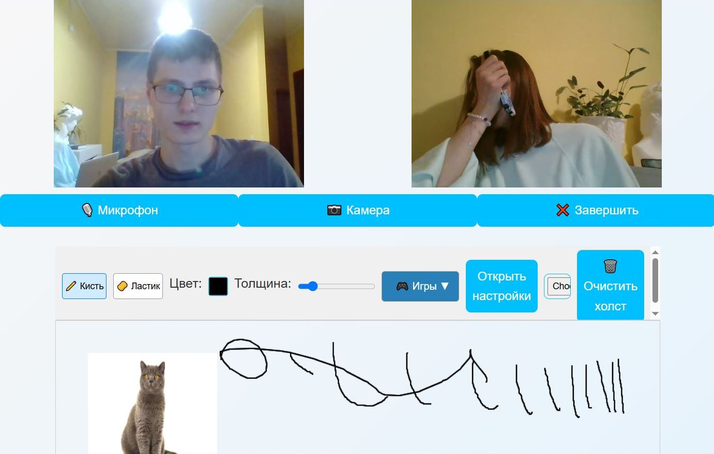

| 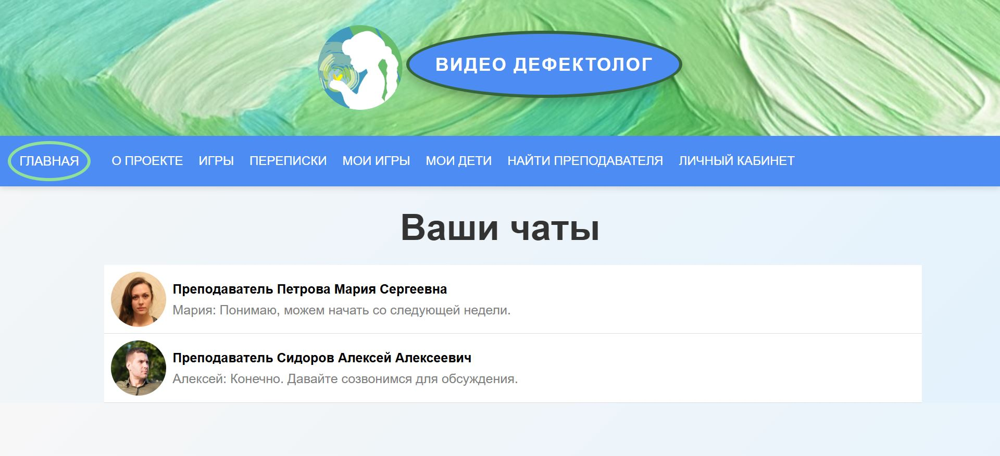 | 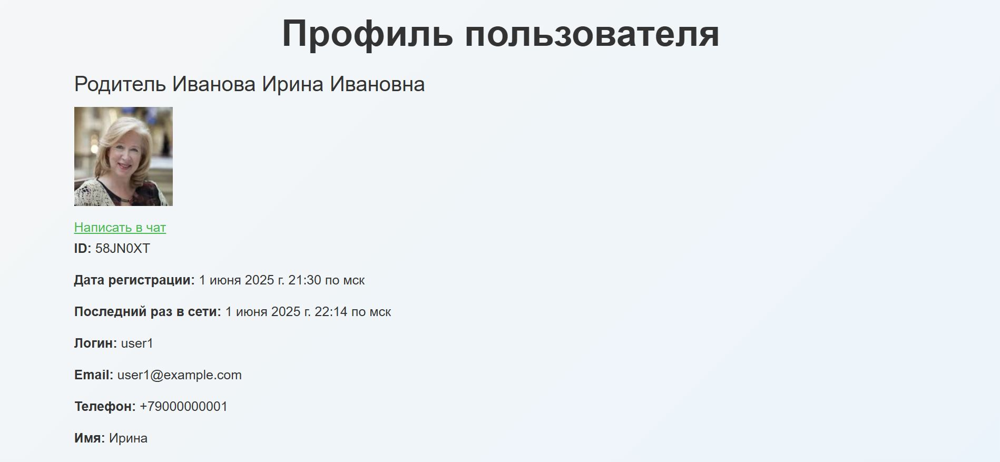 |
|--------------------------------------------------------|----------------------------------------------------|
| 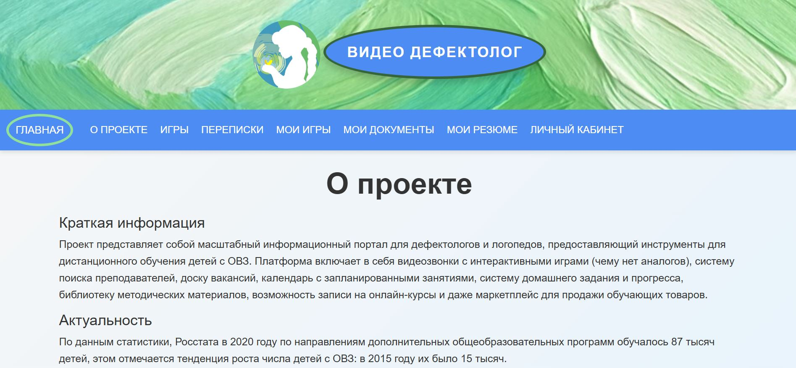 | 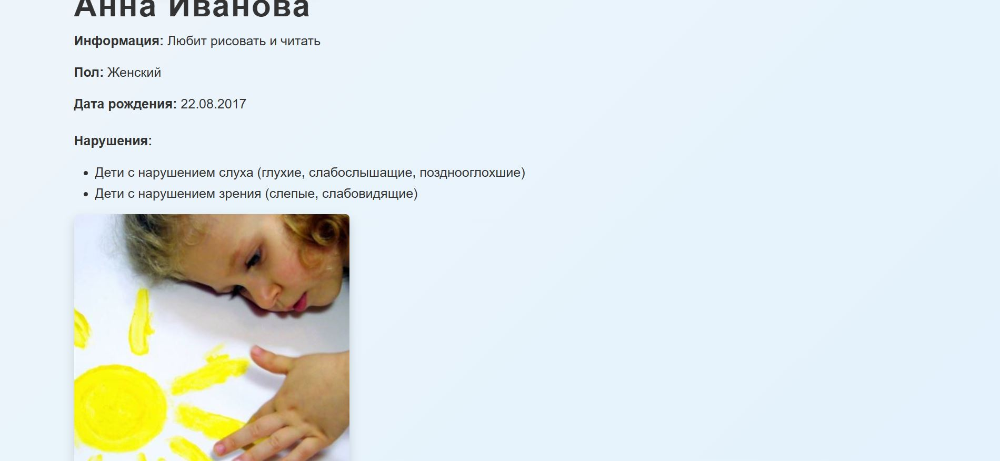 |
| 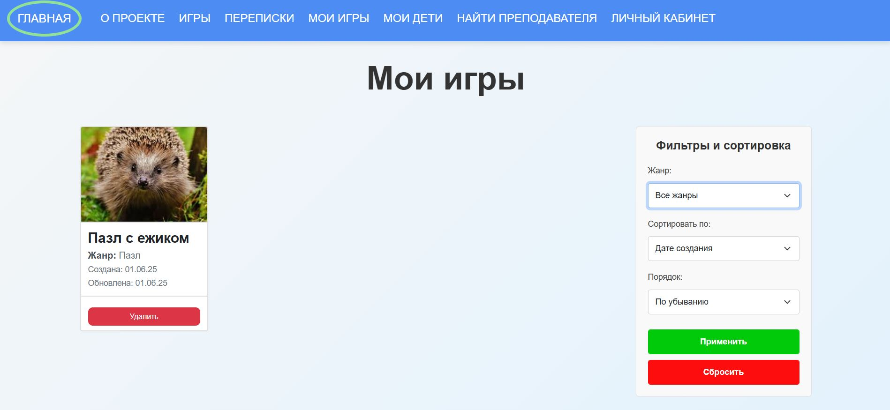 | 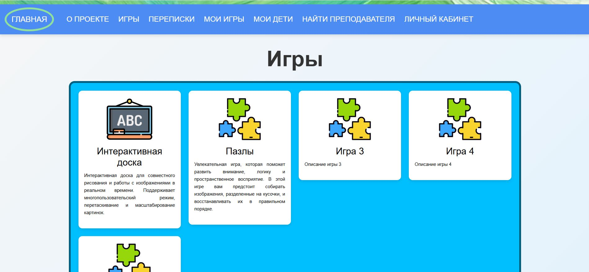 |
| 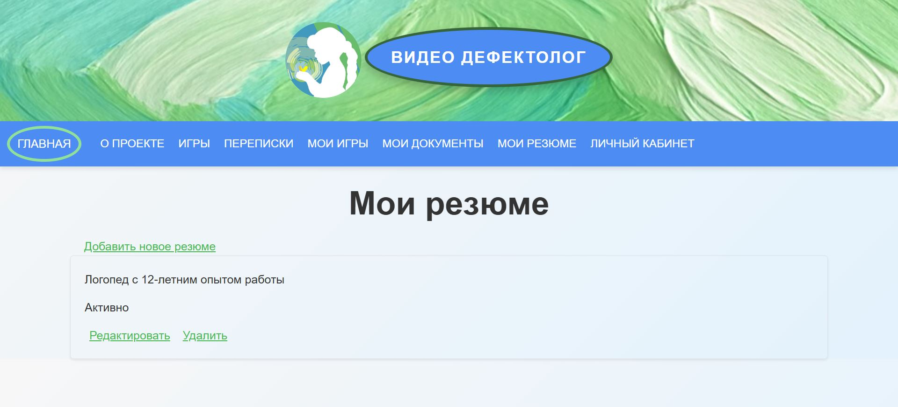 | 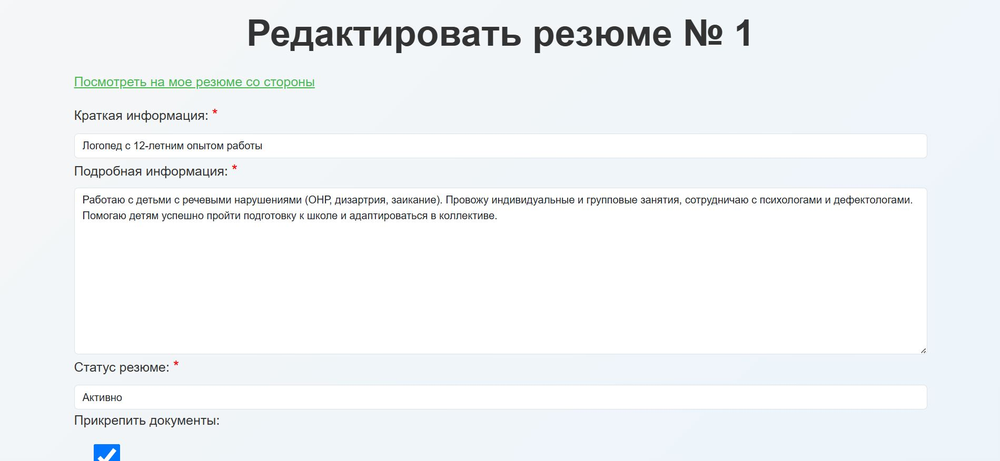 |
| 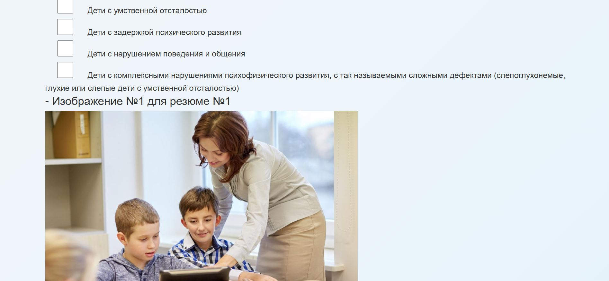 | 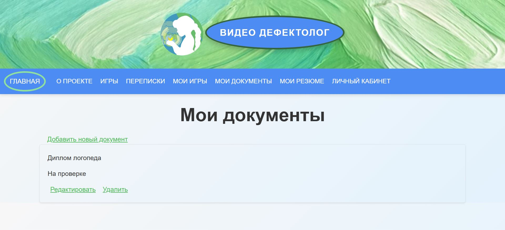 |
| 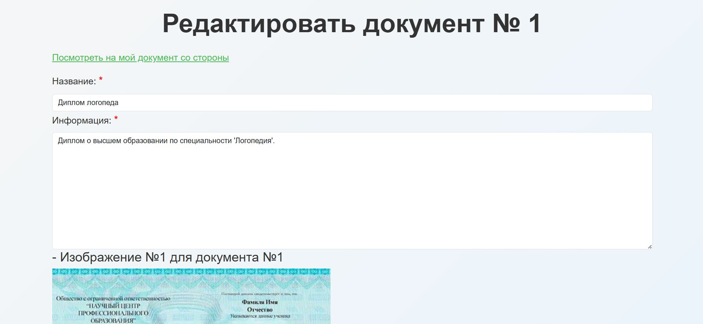 | 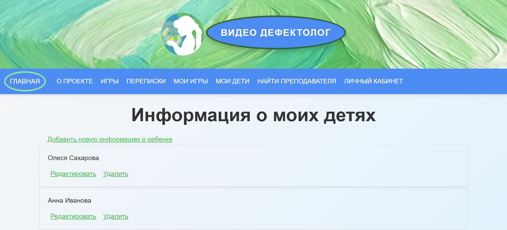 |
| 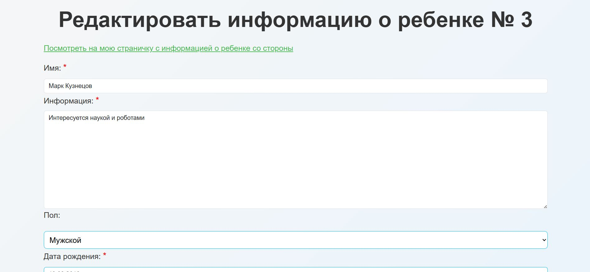 | 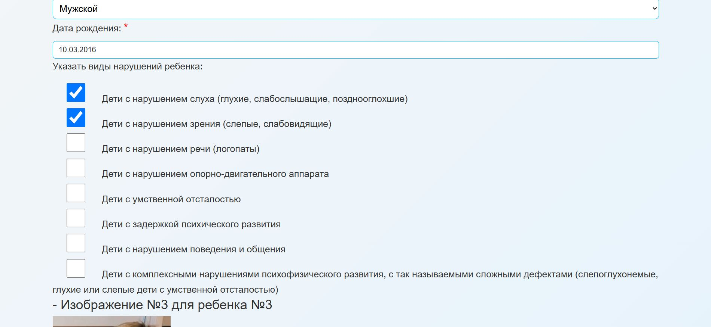 |
| 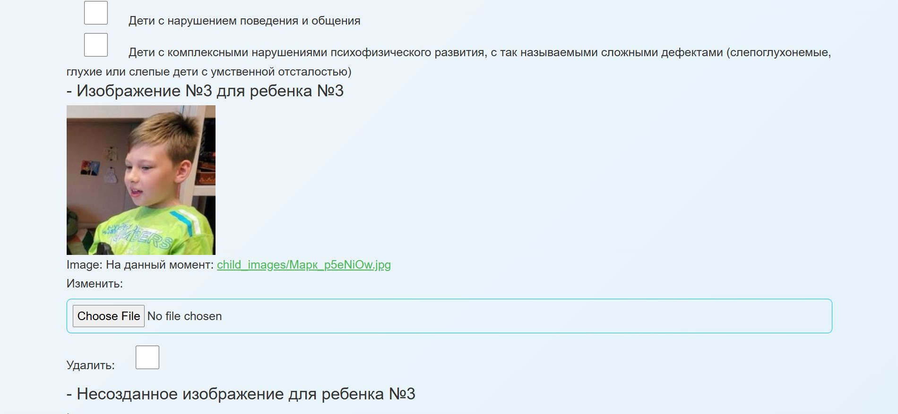 | 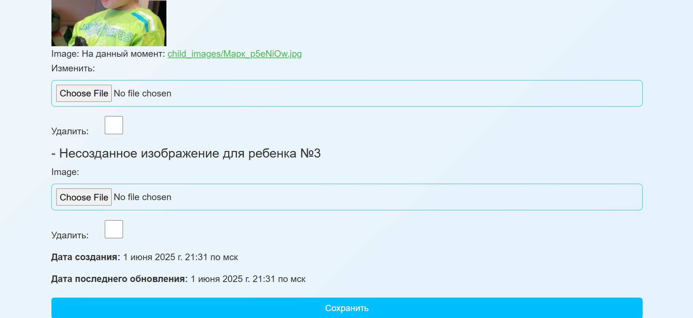 |

# ⚙️ Установка

Для установки и запуска проекта сайта необходимо:

## 1. Клонировать репозиторий

```bash
git clone https://github.com/timoncraus/videodef.git
cd videodef
```

## 2. Создать и активировать виртуальное окружение

После выполнения этой команды у вас должно отобразиться `(.venv)` перед строкой ввода.

```bash
python -m venv venv
.venv\Scripts\activate
```
## 3. Установить зависимости

`requirements.txt` находится в корне проекта `videodef`

```bash
pip install -r requirements.txt
```

## 4. Создать .env файл

Файл "`.env`" необходимо создать в корне проекта `videodef`. \
К нему будут обращаться через `os.getenv()` в `main\settings.py`.

Пример заполнения - см. [Переменные окружения .env](#-переменные-окружения-env).

## 5. При запуске на новой базе данных выполнить миграции для создания таблиц

```bash
python manage.py migrate
```

## 6. Запустить сервер

После этой команды сайт будет доступен по ссылке `http://127.0.0.1:8000/`.

Запуск с указанием порта для дальнейшего подключения других устройств по видеосвязи:
```bash
python manage.py runserver 0.0.0.0:8000
```
Для пробных запусков часть `0.0.0.0:8000` (или другой порт, использующийся на сервере для подключения пользователей к сайту) можно опустить.

# 🔑 Переменные окружения .env

Для запуска сайта нужно создать `.env` файл в корне проекта. \
`.env` файл имеет приоритет над установленными в среде переменными окружения. \
Пример заполнения:

```env
SECRET_KEY=secretkeyhere # секретный код Django
DEBUG=True
ALLOWED_HOSTS=localhost,127.0.0.1,*
DB_NAME=postgres # название базы данных
DB_USER=postgres
DB_PASSWORD=passwordhere # пароль от базы данных
DB_HOST=localhost
DB_PORT=5432
```

# 🧪 Заполнение тестовыми данными

Для ознакомления с проектом и проверки его работы можно сгенерировать тестовые данных с информацией о несуществующих людях, их картинками, их резюме, их сообщениями и так далее. \
Для этого в папке `main\management\commands` существует файл `create_all.py`, который внутри вызывает команды, генерирующие минимальные данные, плюс информация о несуществующих людях. \
Другими словами, `create_all` вызывает внутри себя `create_min`, а также другие команды.

Для запуска этого файла достаточно перейти в папку проекта `videodef` и выполнить команду, отражающая название `create_all.py`:

```bash
python manage.py create_all
```
> [!IMPORTANT]
> Стоит отметить, что перед запуском этой команды также необходимо перейти в виртуальное окружение `.venv`, которое необходимо было создать ранее (см. [Установка](#️-установка)):
> 
> ```bash
> .venv\Scripts\activate
> ```

Ниже можно наблюдать результат работы описанной команды `create_all`:

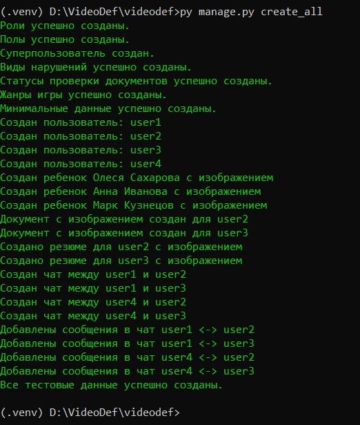

После запуска команды `create_all` будут доступны пользователи `user1` (Родитель), `user2` (Преподаватель), `user3` (Преподаватель) и `user4` (Родитель). \
У каждого из этих пользователей пароль `pass1234`.

Аватарки и картинки для этих несуществующих  пользователей, их резюме, документов, детей и игр берутся из `main\management\commands\photos` и после загрузки получают название из случайного набора символов и сохраняются в папку `media`. \
То же самое происходит и с любыми другими картинками, загруженными реальными пользователями на сайт.

Функционал родителя и преподавателя различается - см. [Обзор](#-обзор).

Также после запуска команды будет доступен суперпользователь (администратор) с логином `admin` и паролем `admin123`. Этот логин и пароль необходимо ввести в `http://0.0.0.0:8000/admin/`.

# 🌱 Заполнение минимальными данными

Для использования проекта сайта по прямому назначению необходимо сгенерировать базовые минимальные данные в таблицах, на которые впоследствии будут ссылаться другие после регистрации пользователей, оформления резюме и так далее:
- Таблица "Роль" (Преподаватель и Родитель)
- Таблица "Пол" (Мужской и Женский)
- Таблица "Вид нарушений" (Дети с нарушением слуха, Дети с нарушением зрения и т.д.)
- Таблица "Статус проверки документа" (На проверке, Проверено и Отказано) \
и другие...

Для этого в папке `main\management\commands` существует файл `create_min.py`, который внутри вызывает команды, генерирующие минимальные данные, необходимые для функционирования сайта (другими словами, чтобы пользователям было, что выбрать из опций в выпадающем списке).

Для запуска этого файла достаточно перейти в папку проекта `videodef` и выполнить команду, отражающая название `create_min.py`:

```bash
python manage.py create_min
```

> [!IMPORTANT]
> Стоит отметить, что перед запуском этой команды также необходимо перейти в виртуальное окружение `.venv`, которое необходимо было создать ранее (см. [Установка](#️-установка)):
>
> ```bash
> .venv\Scripts\activate
> ```

Ниже можно наблюдать результат работы описанной команды `create_min`:

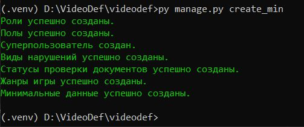

# 📚 Использование

JS и Webpack
---
Перед запуском команд Webpack необходимо:
- установить [Node.js](https://nodejs.org).
- проверить версию (что Node.js действительно установился):
```bash
node -v
```
- инициализировать в папке `frontend`:
```bash
npm init -y
```
- установить Webpack и Webpack CLI:
```bash
npm install --save-dev webpack webpack-cli
```

После редактирования файлов JS в папке `frontend` необходимо запустить сборку (в папке frontend):
```bash
npx webpack
``` 
Либо запустить единожды перед многократными изменениями:
```bash
npx webpack --watch
``` 

Так файлы сгенерируются в папку `videodef\static\js\game` на основе тех, что лежат в `videodef\frontend` \
(например, файл `videodef\static\js\game\whiteboard.js` станет `videodef\frontend\whiteboard.bundle.js`)

В той же папке `frontend` можно найти настройки для Webpack и для конфигурирования генерации им `.bundle.js` файлов.

Однако стоит отметить, что не все файлы JS находятся в папке `frontend`. \
Те `.js` файлы, что в папке `static\js\` не требуют таких действий, так как не разбиты на модули, и их изменение сразу отобразится на сайте \
(иногда нужно почистить кэш браузера, если ничего не изменилось).

Видеозвонки и сервера
---
> [!IMPORTANT]
> **ВАЖНО:** Для тестирования видеозвонков на каждом компьютере в браузере необходимо включить поддержку небезопасного подключения. \
Для Chrome можно вставить следующую ссылку для переход в настройки и ввести туда IP адрес запущенного сайта:
> ```
> chrome://flags/#unsafely-treat-insecure-origin-as-secure
> ```
> Для локального подключения, например, туда можно ввести `http://0.0.0.0:8000/`, после чего нажать на `Enabled`, \
> либо при стороннем подключении ввести какой-либо другой IP адрес. \
> Узнать свой IP адрес можно командой:
> ```bash
> ipconfig
> ```
>
> Так происходит, потому что локально могут быть проблемы с подключением и потому что браузер требует HTTPS при запросе к доступу `getUserMedia()` (камера и микрофон) и `RTCPeerConnection`.
> 
> Предполагается, что в реальном продакшн сервер будет настроены по безопасному соединению HTTPS, чтобы каждому пользователю не приходилось включать доступ к небезопасному подключению вручную и рисковать своими данными, но для разработки этого достаточно.

В файле `videodef\static\js\videocall\videocall.js` поставлена заглушка для проведения видеозвонков на базе серверов Google:
```js
const configuration = {
    iceServers: [{ urls: "stun:stun.l.google.com:19302" }],
};
```
Предполагается, что при использовании в реальных целях будет указан адрес сервера (своего или арендованного), обеспечивающего работу видеозвонков, так как у Google есть ограничения по нагрузке и по количеству на бесплатное использование.

Администрирование Django
---
Django предоставляет панель администрирования по умолчанию, которая уже содержит в себе все необходимые возможности для просмотра, создания, редактирования, и удаления объектов существующих таблиц базы данных удаленно на сервере.

В файле `videodef\account\admin.py` поставлена заглушка для отображения ВСЕХ объектов во вкладке "Администрирование Django" \
(доступная по `http://0.0.0.0:8000/admin/`, где нужно ввести логин и пароль администратора - см. [Заполнение тестовыми данными](#-заполнение-тестовыми-данными)). \
Если вам нужно распределить роли администраторов или не давать одному человеку доступ ко всему, удалите код в этом файле и напишите новый в нем и в других `admin.py` в каждом приложении.

Ниже можно наблюдать демонстрацию панели администратора (все таблицы-модели подписаны в `class Meta: verbose_name = ...`), поэтому в панели легко ориентироваться):

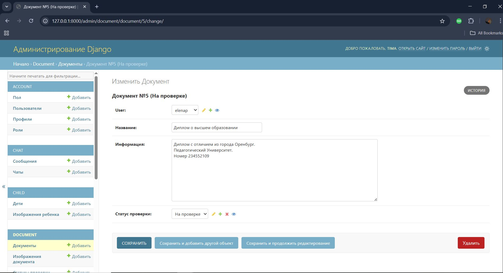

# 📖 Архитектура и документация

Архитектуру проекта, опуская некоторые детали, можно условно представить следующим образом:
```
├── .coverage
├── .coveragerc
├── .env
├── .github
│   └── workflows
│       ├── dependabot.yml
│       └── tests.yml
├── .gitignore
├── .venv
├── README.md
├── codecov.yml
├── coverage.xml
├── coverage_html_report
├── for_readme
├── requirements.txt
├── sql_requests
└── videodef
    ├── account
    ├── chat
    ├── child
    ├── document
    ├── frontend
    ├── game
    ├── main
    ├── manage.py
    ├── media
    │   ├── avatars
    │   ├── child_images
    │   ├── document_images
    │   ├── puzzle_images
    │   └── resume_images
    ├── resume
    ├── static
    │   ├── css
    │   ├── images
    │   └── js
    ├── templates
    ├── videocall
    └── manage.py
```

Папка `.venv` представляет собой виртуальное окружение Python, которое необходимо создать самому вручную для запуска программы. Виртуальное окружение существует для исключения вероятности возникновения конфликтов при смене операционной системы.

В корне папки `videodef` находится `manage.py` для запуска миграций и веб-сайта. \
Всего в папке проекта `videodef` можно найти 8 независимых приложений (модулей), каждая из которых отвечает за свой определенный функционал и которые ссылаются друг на друга:
- `main`
- `account`
- `chat`
- `child`
- `resume`
- `document`
- `videocall`
- `game`

Остальные папки являются вспомогательными и зачастую разделены внутри себя между перечисленными приложениями.

В папке основного приложения `main` находится `settings.py`, в котором прописаны все необходимые для конфигурации и настройки значения. Помимо этого в папке `main` содержится папка `management\commands`, где описаны команды для создания тестовых и минимальных данных для ознакомления с проектом и проверки его работы. (см. [Заполнение тестовыми данными](#-заполнение-тестовыми-данными))

Приложение `account` является вторым по важности, так как объединяет в себе как страницы и их обработку, связанных с созданием учетной записи пользователя, на которого ссылаются все и везде; так и страницы "Главная" и "О проекте".

Внутри каждого приложения (кроме `main`) содержится папка-модуль `tests`, в которой находятся файлы с классами тестов в разном количестве. Все эти тесты автоматически и запускаются в GitHub Actions после определенных коммитов - для проверки работоспособности всей системы после новых изменений. \
В этих тестах описываются проверки создания и удаления пользователей, документов, проверки связи и подключения во время видеозвонков и игр, и многое, многое другое.

В папке `static` находятся статические (неизменные) файлы, которые не будут менять свое содержимое после любых действий пользователей во время работы сайта. \
Внутри содержатся папки `css`, `images` и `js` для файлов стилей, изображений и JS файлов соответственно. \
В папках `css` и `js` для каждого "нуждающегося" приложения отведена своя личная папка файлов, то есть имеется распределение по названию приложений. \
Однако есть и общие для всех приложений `main.css` и `date.js`. \
Внутри папки `static\js` также отчасти содержатся генерируемые Webpack `bundle.js` файлы (см. [JS и Webpack](#js-и-webpack)).

В папке `templates` содержатся все шаблоны - HTML файлы. \
Внутри для каждого приложения отведена своя личная папка файлов, то есть имеется распределение по названию приложений. \
Однако есть и общие для всех приложений файлы - `base.html`, `messages.html` и `non_field_errors.html`.

В папку `media` заносятся загружаемые пользователями изображения для аватарок профилей (`avatars`), для . \
В полях базы данных же просто указывается путь к этому изображению.

В папке `sql_requests` содержатся команды SQL, которые не используются напрямую в проекте, но которые важны для проверки, тестирования и работы с базой данных PostgreSQL (с помощью программы pgAdmin). (см. [Примеры SQL скриптов](#-примеры-sql-скриптов)) \
Также там, в папке `create`, находятся скрипты для создания триггеров - для более надежного регулирования записываемой в базу данных информации, т.е. для проверки данных перед их занесением в базу данных.

Папка `coverage_html_report` представляет собой полностью сгенерированный `coverage` подробный отчет о покрытии кода тестами с распределением по файлам. \
Для просмотра необходимо открыть `index.html`, который лежит внутри.

> [!NOTE]
> **Заметка:** для удобства просмотра и анализа в файле `.coveragerc` (в корне проекта) было прописано игнорировать ненужные к тестированию файлы (например, `/tests/`, `/migrations/`, `/manage.py`).
>
> Из-за этого процент покрытия в отчете (81%) отличается в меньшую сторону по сравнению с бэйджиком Codecov на GitGub (92%).

В папке `for_readme` находятся исходники фотографий и файлов, которые были использованы при написании данной документации `README.md`.

В папке `.github` содержатся файлы `dependabot.yml` и `tests.yml`, которые описывают настройки того, как будет проверяться связь с зависимостями и покрытие тестами после определенных коммитов. От их результата впоследствии и формируются бэйджики, которые можно увидеть в самом верху `README.md`.

# 📊 Диаграммы
Инфологическая модель базы данных.
---
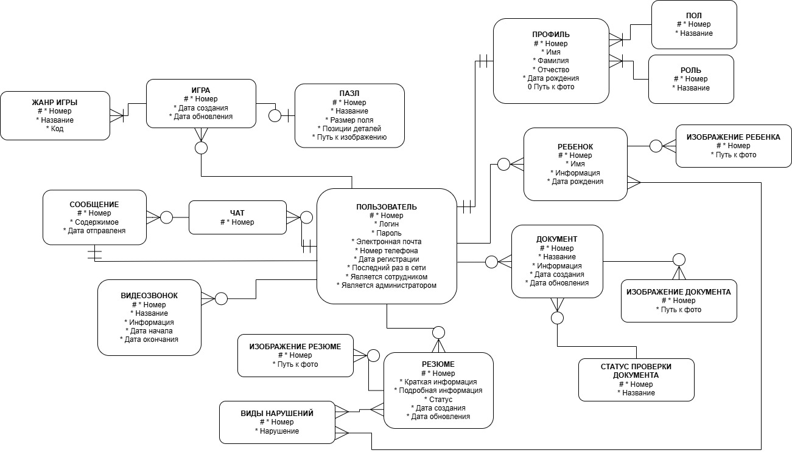
Описаны в общем виде сущности и связи между ними.

Схема базы данных (Даталогическая модель базы данных)
---
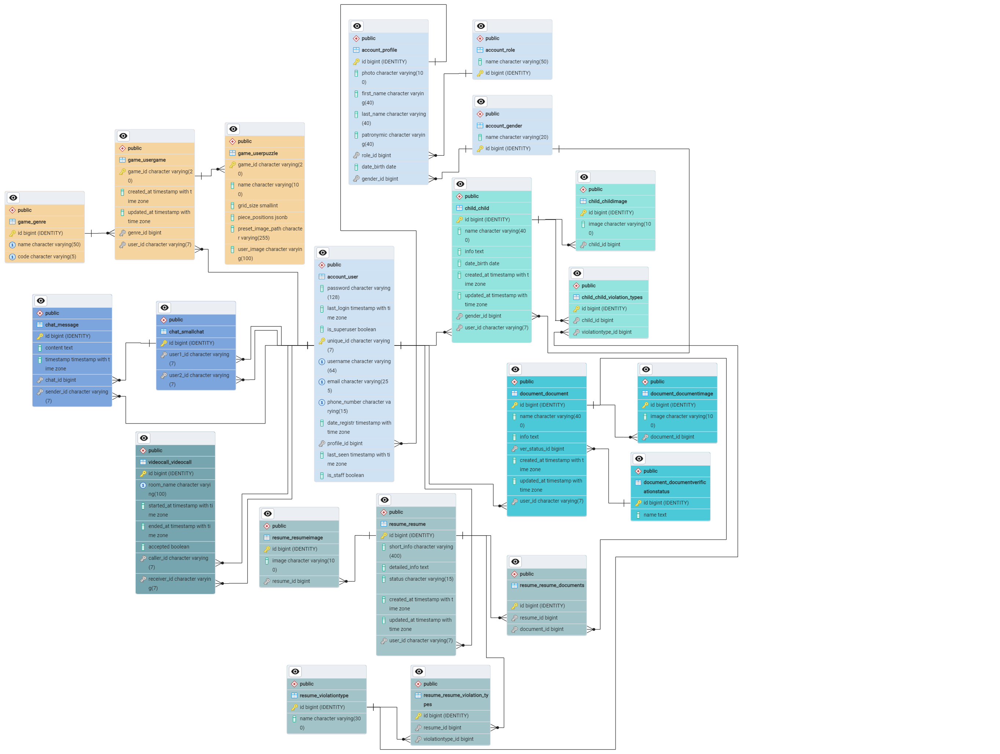
Цветами выделены таблицы, относящиеся к одному приложению.
Автоматически генерируемые таблицы Django были удалены со схемы для более удобного восприятия.

> [!TIP]
> Для просмотра картинки в лучшем качестве вы можете открыть файл `for_readme/database_schema.png`.

Модель BPMN 1 для описания бизнес-процессов.
---
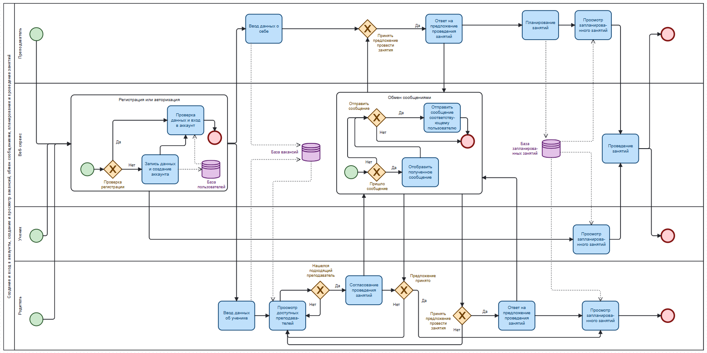
Описаны в виде изображений этапы: 
- регистрации, авторизации,
- ввода данных о себе в резюме, 
- поиска подходящего преподавателя, 
- обмена сообщениями,
- согласования проведения занятий,
- просмотра запланированных занятий,
- проведения занятий.

Действующие лица: Преподаватель, Ученик, Родитель, Веб-сервис.

> [!TIP]
> Для просмотра картинки в лучшем качестве вы можете открыть файл `for_readme/bpmn.png`.

Модель BPMN 2 для описания бизнес-процессов (Интерактивные игры и занятия).
---
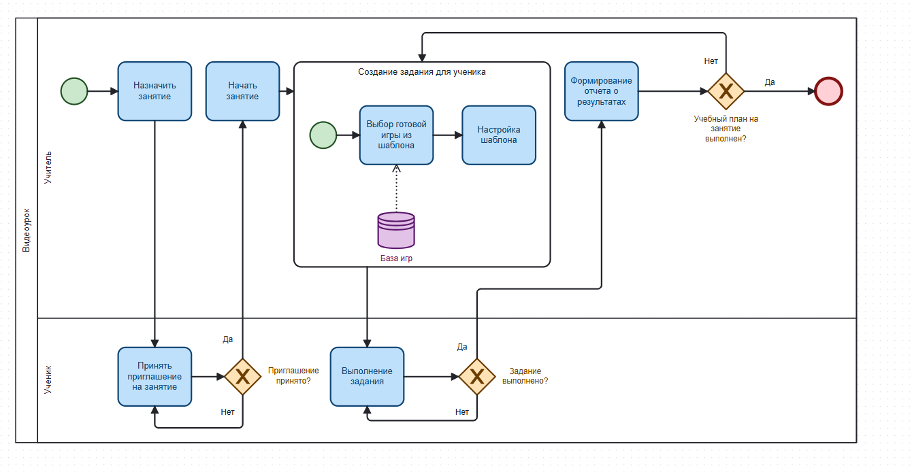
Описаны в виде изображений этапы: 
- назначения занятия,
- создания задания для ученика и настройка шаблона,
- выполнения задания,
- формирование отчета о результатах.

Действующие лица: Преподаватель, Ученик.

> [!TIP]
> Для просмотра картинки в лучшем качестве вы можете открыть файл `for_readme/bpmn_games.png`.

# 🧩 Примеры SQL скриптов

Ниже можно наблюдать команды SQL для демонстрации работы с базой данных.

Эти скрипты не используются напрямую в проекте (кроме создания триггеров), но они важны для проверки, тестирования и удобной работы с базой данных PostgreSQL (с помощью программы pgAdmin):

### 1.	Получить список всех пользователей, зарегистрировавшихся в период с 1 мая по 1 июля 2025 года, с указанием их ролей и профилей.

```sql
SELECT role1.name, profile.first_name, 
	profile.last_name, profile.patronymic,
	user1.username, user1.date_registr
FROM account_user AS user1
JOIN account_profile AS profile ON user1.profile_id = profile.id
JOIN account_role AS role1 ON profile.role_id = role1.id
WHERE user1.date_registr > '2025-05-01'
  AND user1.date_registr < '2025-07-01';
```

Пример обработки запроса со списком пользователей и их профилей:
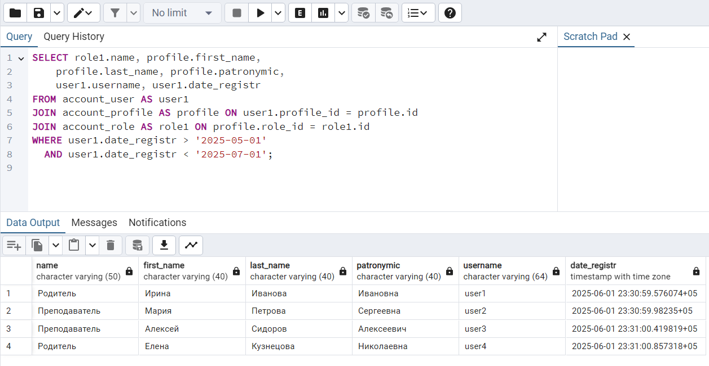

### 2.	Получить информацию о количестве сообщений в каждом чате, включая логины обоих участников.

```sql
SELECT chat.id, user1.username, user2.username, 
	COUNT(1) AS message_count
FROM chat_message AS msg
JOIN chat_smallchat AS chat ON msg.chat_id = chat.id
JOIN account_user AS user1 ON chat.user1_id = user1.unique_id
JOIN account_user AS user2 ON chat.user2_id = user2.unique_id
GROUP BY chat.id, user1.username, user2.username;
```

Пример обработки запроса со списком сообщений в каждом чате:
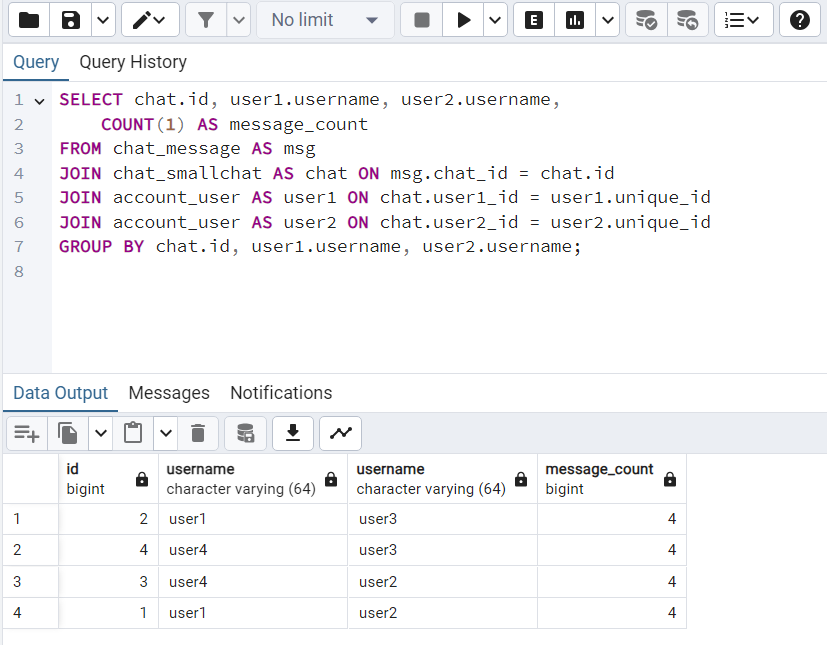

### 3.	Вывести полную информацию о детях, принадлежащих пользователям, с их именами, датами рождения и данными профиля.

```sql
SELECT profile.first_name, profile.last_name, profile.patronymic,
	child.name AS child_name, 
	child.date_birth AS child_date_birth
FROM child_child AS child
JOIN account_user AS user1 ON child.user_id = user1.unique_id
JOIN account_profile AS profile ON user1.profile_id = profile.id;
```

Пример обработки запроса со списком детей и их опекунов:
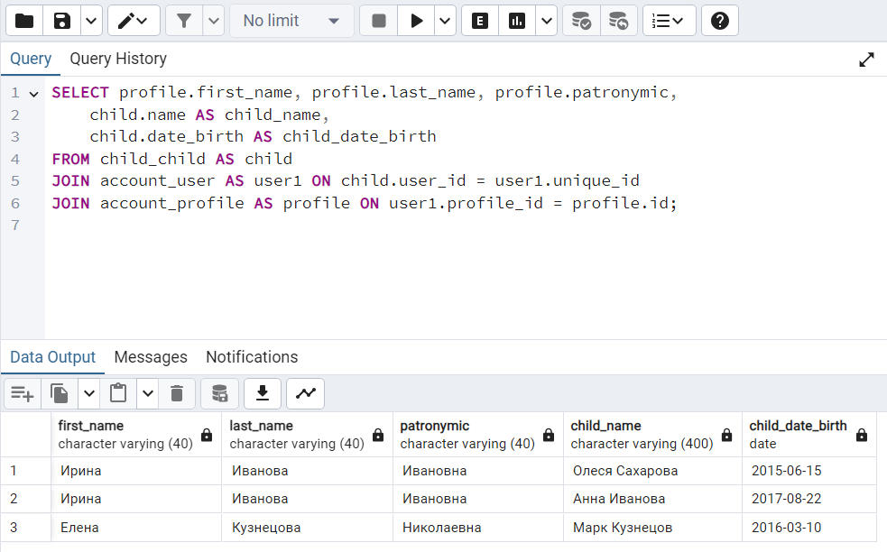

### 4.	Получить количество видеозвонков, проведённых каждым пользователем (как инициатором, так и получателем).

```sql
SELECT user1.username, COUNT(1) AS count_videocalls
FROM videocall_videocall AS videocall
JOIN account_user AS user1 
	ON videocall.caller_id = user1.unique_id
	OR videocall.receiver_id = user1.unique_id
GROUP BY user1.username;
```

Пример обработки запроса со списком пользователей и количеством проведенных видеозвонков:
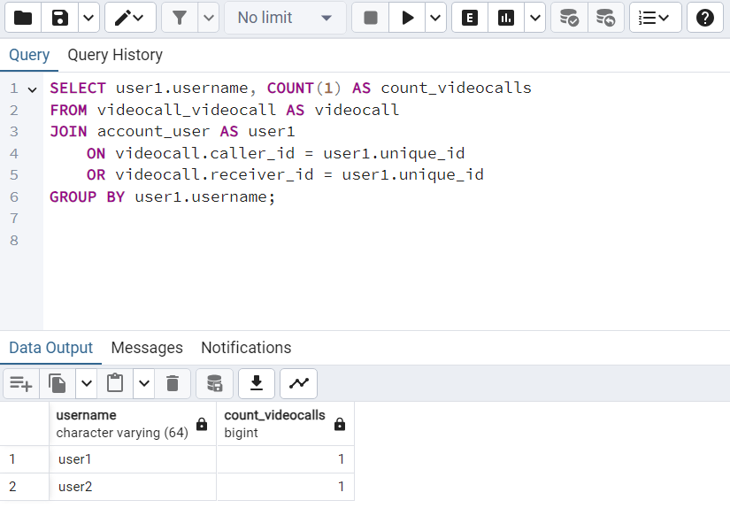


### 5.	Вывести подробную информацию по резюме преподавателя, включая количество изображений, типов нарушений, документов и количество документов, находящихся на проверке.

```sql
SELECT user1.username,
	resume.short_info, resume.status, 
	COALESCE(image_count.num, 0) AS image_count,
	COALESCE(v_type_count.num, 0) AS v_type_count,
	COALESCE(doc_count.num, 0) AS doc_count,
	COALESCE(ver_doc_count.num, 0) AS ver_doc_count
FROM resume_resume AS resume
JOIN account_user AS user1 ON resume.user_id = user1.unique_id
LEFT JOIN (
	SELECT image.resume_id, COUNT(1) AS num
	FROM resume_resumeimage AS image
	GROUP BY image.resume_id
) AS image_count ON resume.id = image_count.resume_id
LEFT JOIN (
	SELECT v_type.resume_id, COUNT(1) AS num
	FROM resume_resume_violation_types AS v_type
	GROUP BY v_type.resume_id
) AS v_type_count ON resume.id = v_type_count.resume_id
LEFT JOIN (
	SELECT doc.resume_id, COUNT(1) AS num
	FROM resume_resume_documents AS doc
	GROUP BY doc.resume_id
) AS doc_count ON resume.id = doc_count.resume_id
LEFT JOIN (
	SELECT pinned_doc.resume_id, COUNT(1) AS num
	FROM resume_resume_documents AS pinned_doc
	JOIN document_document AS doc ON pinned_doc.document_id = doc.id
	JOIN document_documentverificationstatus AS status ON doc.ver_status_id = status.id
	WHERE status.name = 'На проверке'
	GROUP BY pinned_doc.resume_id
) AS ver_doc_count ON resume.id = ver_doc_count.resume_id
```

Пример обработки запроса со списком резюме и их подробной информаций:
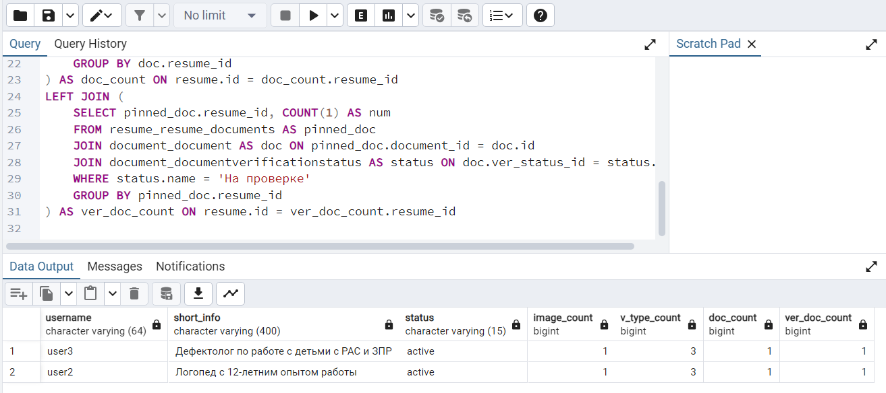

### 6.	Добавление нового пользователя-преподавателя.

```sql
INSERT INTO account_user (unique_id, username, password, email, phone_number, date_registr, is_staff, is_superuser, last_seen)
VALUES ('AAAAAAA', 'new_teacher', 'hashed_password', 'email@example.com', '89999999999', NOW(), TRUE, FALSE, NOW());
```

Пример обработки запроса со добавлением пользователя:
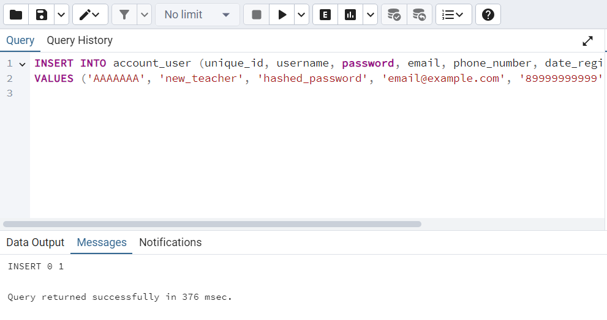


### 7.	Обновление статуса резюме пользователя.

```sql
UPDATE resume_resume
SET status = 'Проверено'
WHERE id = 1;
```

Пример обработки запроса с обновлением статуса документа:
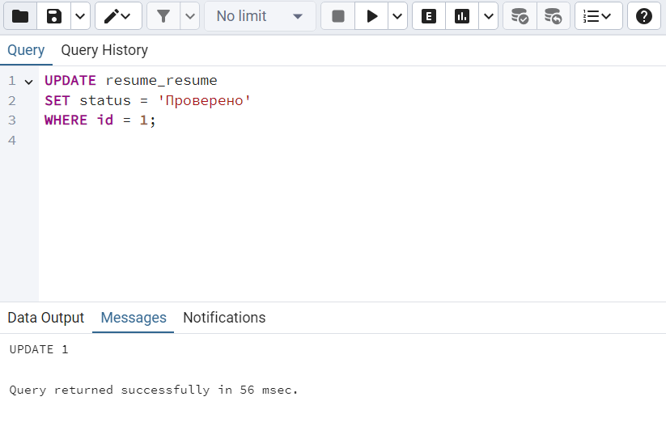

### 8.	Удаление сообщения из чата.

```sql
DELETE FROM chat_message
WHERE id = 2;
```

Пример обработки запроса с удалением сообщения:
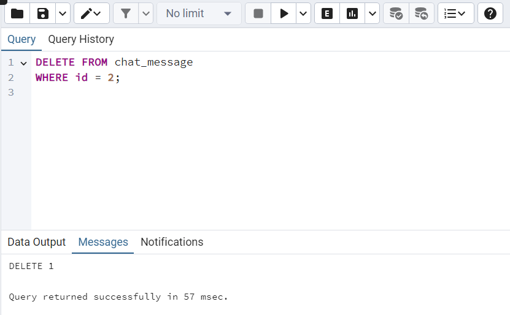

### 9.	Изменение лимита проверки документов на "Проверено" для всех документов определённого пользователя.

```sql
UPDATE document_document
SET ver_status_id = (SELECT id FROM document_documentverificationstatus WHERE name = 'Проверено')
WHERE id IN (
	SELECT document_id
	FROM resume_resume_documents
	WHERE resume_id IN (
		SELECT id 
		FROM resume_resume 
		WHERE user_id = 
			(SELECT unique_id 
			FROM account_user 
			WHERE username = 'user1')
	)
);
```

Пример обработки запроса с обновлением статуса документов определенного пользователя:


# 👥 Авторы

Горшков Тимофей ([timoncraus](https://github.com/timoncraus)) - задумка, архитектура, личный кабинет, чаты, резюме, документы, видеозвонки, главная страница, страница "о проекте", тесты с выводом процента покрытия кода, тестовые и минимальные данные, бэйджики, оформление и документация.

Саликов Иван ([Ivan-Salikov](https://github.com/Ivan-Salikov)) - список игр, белая доска, пазл, редактирование и сохранение игр.

# 🔭 Перспективы развития

Идеи для дальнейшей реализации:
- Больше игр \
  *(цветные и красочные, с удобными готовыми шаблонами)* \
  **Например:** карточки для запоминания, дорисовать картинки по клеточкам, соединять точки (клеточек), игра со звуками (речевые и неречевые звуки), угадай эмоцию, за и под коробкой (предметом) и др. 
- Больше цветов для доски.
- Прикрепление пользователя преподавателем к своей игре \
  (которая будет у этого пользователя отображаться после прикрепления).
- Система отслеживания прогресса выполнения игр-заданий и их статистика.
- Добавить пагинацию (делить данные на страницы и показывать только первые 10 резюме, а дальше перемещаться по стрелочкам).
- Режим для слабовидящих.
- Расписание запланированных занятий.
- Система постов, оценок и комментариев к ним.
- Система рейтинга преподавателей.
- Поиск людей по ФИО, Email, ID и т.д.
- Синхронизировать получение сообщение вне чата.
- Прочитанные и непрочитанные сообщения.
- Возможность удалять и редактировать сообщения.