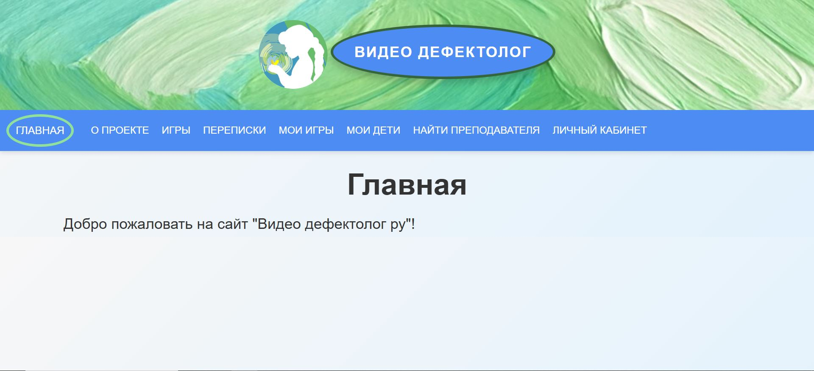

[](https://github.com/timoncraus/videodef/actions/workflows/tests.yml)
[](https://codecov.io/gh/timoncraus/VideoDef)

[](https://github.com/timoncraus/videodef/pulls?q=is%3Apr+author%3Aapp%2Fdependabot)


# 🌟 Обзор

Информационный портал для дефектологов и логопедов, предоставляющий инструменты для дистанционного обучения детей с ОВЗ.


# Навигация

[1. Обзор](#-обзор) \
[2. Возможности](#-возможности) \
[3. Галерея](#-галерея) \
[4. Установка](#-установка) \
[5. Переменные окружения .env](#-переменные-окружения-env) \
[6. Заполнение тестовыми данными](#-заполнение-тестовыми-данными) \
[7. Заполнение минимальными данными](#-заполнение-минимальными-данными) \
[8. Использование](#-использование) \
[9. Архитектура и документация](#-архитектура-и-документация) \
[10. Диаграммы](#-диаграммы) \
[11. Авторы](#-авторы) \
[12. Перспективы развития](#-перспективы-развития)

# 📌 Возможности

# 🖼 Галерея




# ⚙️ Установка

# 🧾 Переменные окружения .env

# 🧪 Заполнение тестовыми данными

# 🌱 Заполнение минимальными данными

# 📚 Использование

# 📖 Архитектура и документация

```
├── .coverage
├── .coveragerc
├── .env
├── .github
│   └── workflows
│       ├── dependabot.yml
│       └── tests.yml
├── .gitignore
├── .venv
├── README.md
├── codecov.yml
├── coverage.xml
├── coverage_html_report
├── for_readme
├── requirements.txt
├── sql_requests
├── structure.txt
├── tree.py
└── videodef
    ├── account
    ├── chat
    ├── child
    ├── document
    ├── frontend
    ├── game
    ├── main
    ├── manage.py
    ├── media
    │   ├── avatars
    │   ├── child_images
    │   ├── document_images
    │   ├── puzzle_images
    │   └── resume_images
    ├── resume
    ├── static
    │   ├── css
    │   ├── images
    │   └── js
    ├── templates
    ├── videocall
    └── manage.py
```

# 📊 Диаграммы

# 👥 Авторы

# 🔭 Перспективы развития

Идеи для дальнейшей реализации:
- Больше игр \
  *(цветные и красочные, с удобными шаблонами)* \
  **Например:** карточки для запоминания, дорисовать картинки по клеточкам, соединять точки (клеточек), игра со звуками (речевые и неречевые звуки), угадай эмоцию, за и под коробкой (предметом) и др. 
- Больше цветов для доски
- Прикрепление пользователя преподавателем к своей игре \
  (которая будет у этого пользователя отображаться после прикрепления)
- Режим для слабовидящих
- Расписание запланированных занятий
- Система постов, оценок и комментариев к ним
- Система рейтинга преподавателей
- Поиск людей по ФИО, Email, ID и т.д.
- Синхронизировать получение сообщение вне чата
- Прочитанные и непрочитанные сообщения
- Возможность удалять и редактировать сообщения
- 
-
